# `bdrive` CLI & sync engine — class diagram

Source of truth: `cmd/bdrive` (commands, gates) and `internal/{syncer,store,
journal,config,daemon,agenthooks,autostart}`; the `internal/remote` seam is drawn in
[webapp-server.md](webapp-server.md). Reflects the code as of this commit;
update this file in any PR that changes these types or their relationships.

## Sync engine — one cycle

```mermaid
classDiagram
    direction LR

    class Session {
        +Folder string
        +MountID string
        +Store *store.Store
        +Device config.Device
        +Account config.Settings
        +Backend remote.Backend
        +Note string
        +SessionID string
        +Prune bool
        +OnProgress func
        +Cycle(ctx) Result
        -cycleLocked(ctx) Result
        -firePostSync(res)
        -logInbound(rel, deleted)
        +Restore(ctx, path, sha) error
        -pushChunked(ctx, blob) bytes
        -fetchChunked(ctx, op, basis) error
        -chunkSpans(blob) []span
    }
    note for Session "syncer also exposes LogEntries (causal order, what bdrive restore walks) plus CommitTime / DisplayTime / SortForDisplay — the order bdrive log prints: newest-first by when a change was journaled (CommitTime), tie-broken by the file's own write time (DisplayTime) so one scan reads by edit time"
    note for Session "Restore writes a historical blob back into the working folder as an ordinary edit (fetching it from the hub when this device never held it) — the next Cycle journals it like any other change; it takes no lock and appends to no journal itself"
    note for Session "internal/syncer — scan → commit local ops → pull peer journals → adopt on join → re-assert withdrawn ops → preserve conflicts → refresh rules → prune → materialize → push blobs then own journal"
    note for Session "pull returns TWO lists: newly seen ops, and `gone` — ops a peer deleted from a journal this device had already applied. A peer cannot un-say what we already hold: stillHold re-signs each still-held put into OUR journal (reassertNote). Pull resumes at a byte offset by prefix-matching the local journal copy, so a peer's growing journal is read once"
    note for Session "Bounds and hardening applied throughout: sizeBound/pullBound cap a fetch against the op's declared size, maxPeerJournals caps how many peers one cycle reads, absorbLamport/tickLamport refuse an absurd peer clock and saturate instead of wrapping, safeMode masks a materialized file to 0777 &^ 0022 (no setuid/setgid, no group/other write), and safeDevice + os.SameFile keep a peer's device id from naming this device's own journal file"
    note for Session "Cycle is now a thin wrapper: cycleLocked does today's work under the volume flock, then firePostSync spawns the folder's post_sync command AFTER the lock drops, so a hook that runs a bdrive command starts working instead of blocking on the flock the cycle still holds. Splitting the body out is what makes that a property of the code rather than a rule every call site remembers"
    note for Session "logInbound records each materialized peer path BOTH ways — onto Result.Inbound for the post_sync hook (same process as the cycle) and onto the store's inbound spool for bdrive sync --hook (a later process). DrainInbound is destructive and single-consumer: the hook must never drain it"
    note for Session "Prune (bdrive forget / sync --prune, never the daemon) journals a delete for every replayed path the SHARED ignore rules exclude — the include scope is per-device and must never prune it"

    class Result {
        +LocalOps +PulledOps
        +Conflicts +Adopted +Pruned +Materialized
        +Inbound []store.InboundEvent
        +Pushed +Offline +OfflineErr
        +ReadOnly +NoAccess +AccessErr
        +Reason() string
    }
    note for Result "Adopted counts the paths a JOINING device gave to the project (Cycle step 1b). A first cycle is a join, not an edit: a local file at a path the project already holds is demoted to lamport 0 (adoptNote), so the project's version wins on every device and no conflict copy is made — the local content stays journaled and pushed, which is what bdrive restore reads"
    note for Result "Inbound names the paths this cycle applied on a peer's behalf — what firePostSync hands the post_sync command as JSON on stdin. Empty on a scan-and-push cycle, which is why a local-edit-only cycle fires nothing"
    note for Result "Offline / ReadOnly / NoAccess are three different answers: unreachable (retry all), push refused (pull-only), pull refused (pause, touch nothing)"
    note for Result "Reason() is accessReason(AccessErr): the hub's own sentence for a refusal, minus the wrapper chain, dropped unless it passes journal.SafeText. 'read-only' summarizes the STATUS CODE — the sentence is the only thing that tells a device-registration 403 from a project the user really is a reader on"

    class Filter {
        +Skip(rel) bool
        +SkipUp(rel) bool
        +PruneDir(rel) bool
        +AcceptRules(text) scope floor
    }
    note for Filter "ignore.go — .bdriveignore rules (incl. the managed `# bdrive scope` negation block written by init --only / bdrive scope) + a legacy .bdrive include list; Negated() is what makes sync --prune refuse on a scoped project. NOT the whole predicate: walkFolder adds reserved-dir pruning, non-regular and reserved-name skips, and nested-mount handoff"
    note for Filter "The rules are NO LONGER symmetric. Skip governs materialize (download); SkipUp governs scan (upload) and adds the accepted-rules floor from AcceptRules: a pulled rule that NARROWS applies in both directions, a pulled `!` that WIDENS applies only downward — so a teammate editing .bdriveignore can never start uploading a file this device had excluded. .bdriveignore itself is always exempt. underMountOnDisk asks config.IsMount about each ancestor, so the project boundary no longer depends on what this walk happened to discover"
    note for Filter "EscapeIgnore is compile's inverse (escapes the glob metacharacters, the negation and comment markers, and trailing whitespace) so bdrive forget writes a rule matching exactly that path and nothing else"

    class SyncState {
        +Lamport +PushedOps +Access
        +AccessReason
        +IgnoreAccepted +IgnorePulled
    }
    note for SyncState "Access/AccessReason are written ONLY by the leg that asked the hub — pull clears no-access, push records read-only or clears it. A cycle with no remote leg leaves the last answer standing, so the daemon's local-only ticks stop alternating 'read-only' / 'access restored' and bdrive status stops reporting healthy sync moments after a refused push"
    note for SyncState "store — IgnoreAccepted is the .bdriveignore scope THIS device consented to; IgnorePulled is the text a peer's version last wrote here. The pair is what tells a locally authored rule change from one that arrived over the wire. vouchedFloor seeds it once on upgrade: keep every exclusion, drop each `!` that no already-materialized path vouches for"

    class SafePath {
        <<internal/journal — one rule>>
        +SafePath(p) bool
        +SafeText(s) bool
    }
    note for SafePath "The single text/path rule for the whole repo, replacing three drifting copies. SafePath: relative, clean, no .., not absolute. SafeText: no C0/C1/DEL, no Unicode Cf format chars (bidi overrides, tag block), no U+2028/9 — applied to Note/Author/UserName too, since those are rendered. Both hub ingest doors and the CLI's own terminal output now answer to it"

    class ReservedPath {
        <<internal/config — one rule>>
        +ReservedDir(name) .git .bdrive
        +ReservedName(name) .DS_Store, tmp
        +AgentHookConfig(p) bool
        +AgentConfigDir(name) bool
        +ReservedPath(p) bool
    }
    note for ReservedPath "Case-and-trailing-dot folded, so `.BDRIVE.` is still reserved. AgentHookConfig names the files an agent EXECUTES (.claude/settings.json, .codex/*, .gemini, .hermes, .mcp.json at any depth) — a synced project must never be able to hand a teammate's agent new hooks. Deliberately its own list, not derived from internal/agenthooks: config imports nothing. AgentConfigDir answers about ONE segment, for init's mount-root gate: the reserved rule only sees segments BELOW a root, so mounting ~/.claude itself leaves settings.json a bare top-level file"

    class UnderRoot {
        <<internal/store — one rule>>
        +UnderRoot(root, p) bool
    }
    note for UnderRoot "path.go — symlink-aware containment: resolves the root and the deepest existing ancestor of p, so a symlinked directory cannot land a materialized write outside the mount. A dangling component is false. Shared by materialize, the file:// backend, templates, scope-file writes and init's BDRIVE_HOME gate"

    class walkFolder {
        +walkFolder(folder, filter, fn)
        verdict: vSync vSkipFile vDescend vPruneDir vNested
    }
    note for walkFolder "walk.go — the ONLY copy of the sync predicate; scan, Explain, Measure, SyncedFiles and Drift all go through it, so what --explain reports, what init warns about, what bdrive grep searches and what status calls unscanned cannot drift from what leaves"

    class Measure {
        +Measure(folder, include) files, bytes
    }
    note for Measure "walk.go — sizes what a FIRST sync would upload, for the oversized-folder warning bdrive init prints (1 GiB / 20k files). Filter-aware on purpose: a 40 GB repo whose bulk is already ignored measures as the few MB that really sync, so the warning fires on the folder nobody meant to share and stays quiet on an ordinary checkout. Advice only — an unreadable subtree is skipped, never fatal"

    class SyncedFiles {
        +SyncedFiles(folder, include, accepted) paths
    }
    note for SyncedFiles "walk.go — the mount-relative paths that sync, in walk order: what bdrive grep searches, so a .bdriveignore rule or a narrowed scope excludes a file from search exactly as it excludes it from sync. Deliberately NOT Explain, which countFiles every pruned dir — a grep in a repo with node_modules/ would walk it in full for a count it discards"

    class Drift {
        +Drift(folder, include, accepted, cache) added, modified, removed
    }
    note for Drift "drift.go — the `local:` line in bdrive status: what is on disk that the state cache has not seen, using the scan's own size+mtime compare. Pure read like its siblings, and load-bearing that it stays one: status is what someone runs when sync is stuck, so it stores no blob, mints no op, rewrites no cache — it does not even mutate the cache map it is handed, which status prints `files:` from"

    class Explain {
        +Explain(folder, include, accepted) two lists
        +NotSyncedFiles(entries) int
    }
    note for Explain "`accepted` is SyncState.IgnoreAccepted, passed in rather than loaded: Explain opens no volume store, but it must install the same floor SkipUp uses or --explain would describe an upload set that never leaves. bdrive scope reads it best-effort and degrades to no floor"
    class Entry {
        +Path string
        +Files int
        +Nested bool
    }
    note for Explain "explain.go — bdrive scope --explain. Pure read: own Filter, no Session, no flock, no network. Collapses fully-excluded dirs to one counted line; nested mounts annotated, counted as zero (they sync via their own project)"

    class Store {
        -dir volume dir
        +PutBlob / OpenBlob / HasBlob
        +AppendOps / DeviceOps / AllOps
        +LoadCache / SaveCache mountID
        +LoadSync / SaveSync
        +SaveNote / LoadNote
        +LogRead(rel, session) read spool
        +PendingReads dedup on path+session
        +LogInbound / DrainInbound
        +LoadSecrets / SaveSecrets mountID
        +Lock() flock
    }
    note for Store "secrets-mount-id.json is the credential-finding record: what `bdrive status` prints and what the agent hook appends a sentence about. Like the inbound spool it outlives the cycle that wrote it — the daemon scans the write seconds before the turn starts — but unlike it, it is STATE and is never drained: a finding stands until the file changes without it"
    note for Store "internal/store — ~/.bdrive/volumes/mount-id: content-addressed blobs, per-device journal copies, state cache, paused marker (free funcs Paused/SetPaused, no flock)"
    note for Store "inbound.jsonl is the read spool's twin, running the other way: materialize appends every path it wrote or removed for a peer, and `sync --hook` drains it into the turn's context (re-read before editing). A spool and not a Result field because the daemon usually materializes the change seconds before the turn starts, so the hook's own cycle sees nothing. Capped, best-effort, never fails a cycle. Result.Inbound now carries the SAME events for the post_sync hook and is not a duplicate to delete: that consumer fires from the cycle itself, and a second drainer would silently empty the agent hook's context"

    class secretLog {
        <<syncer/secrets.go>>
        found map path to Findings
        dirty bool
        +scanBlob(store, rel, sum)
        +set / drop per path
    }
    note for secretLog "internal/secrets' six rules, run on the path EVERY file takes. Only on the branches that just called PutBlobFile — the cheap size+mtime path never re-reads a file — and it reads the BLOB, i.e. the exact bytes that were hashed and journaled, so a line number can never describe content no op captured"
    note for secretLog "WARN ONLY: the op is journaled and pushed exactly as before. Holding it would strand the file behind a false positive and break the cycle's degrade-to-offline posture. Merged PER PATH into secrets-mount-id.json and written in finish only when dirty — nearly every cycle scans zero files, so a whole-set rewrite would erase the warning seconds after it appeared. A save error is logged, never returned: advisory telemetry gets no veto over convergence"

    class Op {
        +Seq +Lamport +Time +Device
        +Author +User +UserName
        +Kind put or delete
        +Path +Blob +Size +Mode +Note
        +Session agent session, hook-set
        +Mtime when the file was written
    }
    note for Op "internal/journal — Less orders by (lamport, time, device, seq); Replay folds to LWW-per-path state; each device writes only its own journal. Mtime is display-only (bdrive log shows it, falling back to Time) and never feeds Less or Replay. Session holds the same standing: set only by `bdrive sync --hook` (never by --note, which any member can spell), display/join-only, and the key History run cards group on — a note is forgeable, a session id is not"
    note for Op "Op now owns its own JSON: a Path that is not valid UTF-8 rides as a base64 `path_raw` sidecar and is restored only when the lossy form still matches, so one line can never name two different files on two readers. Less falls through to Kind/Path/Blob/Size/Mode, making the order TOTAL — two ops can no longer tie and replay differently per device. Parse skips an undecodable line and drops an unknown Kind instead of failing the whole journal"

    class Manifest {
        +V int
        +Size int64
        +Chunks []chunkRef h, n
    }
    note for Manifest "chunks.go — delta sync. Files over chunkThreshold (4 MiB) push as content-defined chunks (restic/chunker, fixed Rabin polynomial, 256K/1M/4M) under chunks/sha256 plus this manifest under manifests/file-sha — keyed by Op.Blob, so the JOURNAL FORMAT IS UNTOUCHED. pushChunked skips a chunk only when the remote CONFIRMS holding it (one Exists per chunk): three cheaper proxies — local basis, manifest existence, stored manifest content — each proved false or forgeable, and the code comment records why. A refused manifest (write-once 409, ingest 400) falls back to pushing the whole blob, so chunker parameters are not load-bearing. fetchChunked assembles from the manifest, sourcing unchanged chunks from the basis blob already in the local store (cache[path].Blob), verifying the whole against Op.Blob via PutBlobReader; any failure falls through to the whole-blob path, gated on Exists so a transient chunk blip does not trigger hub reassembly every tick. Local blobs stay whole — chunking exists only on the wire and in the remote"

    class Backend {
        <<interface>>
        +Put +Get +List +Exists +Close
        +ErrForbidden sentinel
    }
    note for Backend "internal/remote — client devices use the https:// hub backend (token from BDRIVE_TOKEN / settings.json); a hub 403 wraps ErrForbidden, which is what Result turns into ReadOnly/NoAccess instead of Offline"

    class daemon {
        +Run(folder, scan, remote)
        +Start / Stop / Running
    }
    note for daemon "per-mount detached loop; re-reads .bdrive/config.json each tick, exits without deletes if it vanishes"

    Session --> Store : volume state
    Session --> Backend : pull and push
    Session --> Manifest : chunked push and pull, files over 4 MiB
    Session --> Filter : SkipUp on scan, Skip on materialize
    Session --> walkFolder : scan
    Explain --> walkFolder : same predicate
    Drift --> walkFolder : same predicate
    Drift --> Filter : own fresh instance
    SyncedFiles --> walkFolder : same predicate
    SyncedFiles --> Filter : own fresh instance
    Measure --> walkFolder : same predicate
    Measure --> Filter : own fresh instance
    Explain --> Filter : own fresh instance
    Explain ..> Entry : not-synced lines
    walkFolder --> Filter : SkipUp / PruneDir / addNestedMount
    Session --> secretLog : scan flags, finish persists
    secretLog --> Store : reads the blob, writes secrets-mount-id.json
    Session ..> Op : commits, replays
    Session --> Result
    Store o-- Op : journal files
    Store *-- SyncState : sync.json
    Session --> SyncState : reads the floor, records what it accepted
    SyncState ..> Filter : AcceptRules(IgnoreAccepted)
    Session ..> SafePath : every path and note, in and out
    Session ..> UnderRoot : materialize writes and deletes
    walkFolder ..> ReservedPath : never-sync set
    Session ..> ReservedPath : neverSync = unsafeRel or reserved
    daemon --> Session : one Cycle per tick
```

## CLI commands, device state, and the opt-in gate

```mermaid
classDiagram
    direction LR

    class Commands {
        init login logout
        sync stop scope grep stale forget status log
        restore url share export import
        web daemon hooks read-log
        resume autostart
    }
    note for Commands "cmd/bdrive — thin cobra layer; init is the front door (one command: login + hooks + sync + link), stop pauses"
    note for Commands "grep searches file CONTENTS in the working folder via syncer.SyncedFiles — LoadProject not ResolveMount (a read must not enroll the device), no session, no flock, and the volume store is opened only if it already exists, so a search creates nothing. Exit 1 on no match is a status, not an error (errNoMatch + SilenceErrors). stale copies that whole posture and swaps the predicate: it extracts path-shaped references from synced markdown, keeps only the ones resolving into the SyncedFiles set, and flags a doc whose reference was written later. It dates a path from the JOURNAL, not os.Stat — materialize stamps a peer's file with this device's mtime, so mtime comparison reports nothing on a freshly cloned machine — folding st.AllOps() to the max syncer.DisplayTime per path, which drops a forged future stamp instead of dating that path to year 1. Unlike grep it exits 0 either way: advisory output, not a gate"
    note for Commands "Every peer-authored string status / log / whoami print goes through safeField first — a teammate's file name is attacker-controlled text landing in your terminal, and an escape sequence there rewrites the line above it. grep runs BOTH the path and the matched line through it — a matched line is a teammate's file content, the widest version of that surface. login now does PKCE on the loopback callback (no compat arm) and both its client and init's refuse to follow a redirect off the hub's origin with the device token attached"

    class Templates {
        <<internal/templates>>
        go:embed all:files — docs, wiki, para, skills
        List / Get / Names
        WriteTo(dir) skips existing paths
    }
    note for Templates "The embed directive is `all:` — a plain pattern drops dot-prefixed paths silently, and the skills template IS .claude/skills/<name>/SKILL.md. init --template <name>: refused with --only and on an unknown name BEFORE any write. The hub seeds at creation (the CLI creates through POST /api/projects), so WriteTo runs only as the fallback for a hub too old to know the field, and in an already-initialized folder — the agent's post-init path. Skipping existing paths is what makes a double-seed a no-op"

    class syncBlocked {
        <<gate>>
        enrolled in mounts.json?
        volume not paused?
    }
    note for syncBlocked "cmd/bdrive/helpers.go — sync, sync --hook, and read-log must pass it; reads the registry WITHOUT ResolveMount's enrolling self-heal. Hook mode fails silent; plain sync errors with a bdrive init pointer"

    class openSession {
        mustProject → ResolveMount
        store.Open + remote.Open
    }
    class startSync {
        enroll + clear paused
        initial Cycle
        daemon.Start
    }
    note for startSync "cmd/bdrive/sync_run.go — init's engine; the ONLY enroller and the only thing that resumes a pause"

    class Project {
        +ID stable mount id
        +Volume +Remote
        +Include legacy, read-only
        +PostSync local hook command
    }
    note for Project ".bdrive/config.json — travels with the folder (git clone, copy); presence alone is NOT consent to sync"
    note for Project "PostSync is a shell command this device runs after a cycle applies peers' changes. It lives here and ONLY here: .bdrive is in ReservedDirs and never syncs, so no hub and no teammate can put a command on someone else's machine. The daemon re-reads this file every tick, so an edit takes effect without a restart"

    class MountRegistry {
        mounts.json
        id → Path Volume Remote
        + Dev + Ino directory identity
        +ResolveMount read and self-heal
        +EnrollMount writes the row
        +ValidMountID(id) bool
    }
    note for MountRegistry "ResolveMount and EnrollMount are now two gestures, not one. ResolveMount NEVER creates a row: it self-heals the path only when Dev/Ino prove it is the same directory (a move), so a COPY of a project folder no longer silently enrolls itself as the original and starts writing that project's journal — it errors and points at bdrive init. EnrollMount is ResolveMount plus the write, and startSync is its only caller. ValidMountID keeps a hand-edited id out of a filesystem path (it names a directory under BDRIVE_HOME)"
    class Device {
        device.json
    }
    class Settings {
        settings.json
        server + token + account
    }
    note for MountRegistry "internal/config — per-device state under BDRIVE_HOME, which Home() now absolutises and ensureHome() creates 0700 (and tightens if an older version left it 0755): device.json, settings.json and every volume live there"

    class AgentHooks {
        Detect / Install / Uninstall / Registered
        ConfigPath = USER config
        turn-start: sync --hook
        post-edit: sync --note
        post-read: read-log
    }
    note for AgentHooks "internal/agenthooks — registers per-platform hook commands (claude, codex, gemini, hermes) in each platform's USER config, once per machine; they fire in every folder, every turn, and no-op outside mounts"
    note for AgentHooks "config.AgentHookConfig is the OTHER half of this story and deliberately NOT this package: it names the files an agent READS hooks from, so sync refuses to carry them. A teammate must never be able to push .claude/settings.json into your mount and have your next turn run their command. The two lists are kept apart on purpose — one is what we write, one is what the agent executes — and internal/config imports nothing to say it"

    class PausedMarker {
        volumes/id/paused
    }
    note for PausedMarker "set by bdrive stop, cleared only by bdrive init (startSync)"

    class Autostart {
        Install / Uninstall / Installed / Path
        launchd | systemd | HKCU Run
        ErrUnsupported (BSD, no-systemd)
    }
    note for Autostart "internal/autostart — ONE login unit per machine that runs `bdrive resume`: darwin a LaunchAgents plist (RunAtLoad, no KeepAlive), linux a systemd user unit + its default.target.wants symlink (needs sd_booted), windows an HKCU Run value. Writes the registration only — never launchctl/systemctl/schtasks"

    class DaemonLock {
        volumes/id/daemon.lock
        volumes/id/daemon.pid
    }
    note for DaemonLock "internal/daemon — liveness is the flock, held for the daemon's lifetime; the kernel drops it at death/reboot, so a leftover pid can never read as running. Start writes no pid — it waits for the lock, so a returned pid always has a daemon behind it"
    note for DaemonLock "The pid Stop SIGNALS now lives INSIDE the flock'd daemon.lock, written by announce after the lock is taken and truncated by release. daemon.pid became display-only and is never signalled: it is an ordinary file in a synced-adjacent tree, so anything that could rewrite it could aim a kill at any process on the machine. The lock is opened O_NOFOLLOW, and an unopenable lock reads as running only when this process is the one holding it"

    Commands --> Autostart : autostart install/uninstall (init runs install automatically)
    Autostart ..> Commands : login runs `bdrive resume`
    Commands --> DaemonLock : Running / Start / Stop
    Commands --> AgentHooks : hooks install/uninstall (init runs install automatically)
    AgentHooks --> Commands : runs sync and read-log
    Commands --> syncBlocked : sync and read-log gate first
    syncBlocked --> MountRegistry : reads only, never enrolls
    syncBlocked --> PausedMarker : Paused check
    Commands --> openSession : after the gate
    openSession --> MountRegistry : ResolveMount — self-heal only, never enrolls
    Commands --> Templates : init --template (seed) / init resume (agent's post-init path)
    Commands ..> ReservedPath : init refuses an AgentConfigDir mount root
    Commands --> startSync : init
    startSync --> MountRegistry : EnrollMount — the only writer
    startSync --> PausedMarker : clears
    Commands --> PausedMarker : stop sets
    openSession ..> Project : loads
    openSession ..> Device : identity
    openSession ..> Settings : account and token
```


